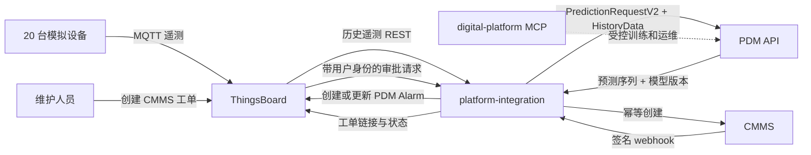

# CMMS、ThingsBoard 与 PDM 预测维护闭环设计

## 文档状态

- 日期：2026-07-29
- 状态：设计已在对话中逐节确认，等待书面设计复核
- 首期环境：ThingsBoard 汽车工厂本地模拟环境
- 首期规模：20 台模拟设备、六种设备类型、每台设备一个主要预测测点

## 目标

在保持 CMMS、ThingsBoard、PDM 和 `digital-mcp` 领域边界的前提下，建立第一条可审计、可恢复的预测维护闭环：

```text
ThingsBoard 遥测
  → PDM 周期预测
  → 版本化风险判定
  → ThingsBoard 待确认告警
  → 维护人员明确批准
  → CMMS 幂等创建工单
  → 工单状态和维修结果反馈
```

首期预测周期为 15 分钟，允许部署时在 15–60 分钟范围内调整。工单必须由维护人员在 ThingsBoard 告警面板中点击“创建 CMMS 工单”后产生；普通 Alarm ACK 不代表创建工单的授权。

## 非目标

首期不实现：

- 真实生产设备接入；
- 无人值守自动派单；
- 自动或批量模型训练；
- Kafka、RabbitMQ 或其他消息总线；
- CMMS 备件自动预留；
- 多租户商业化配置界面；
- 让 PDM、CMMS、ThingsBoard 或集成服务直连其他组件数据库；
- 让 Codex、Skill、MCP 或 ThingsBoard Rule Chain 充当常驻业务编排引擎。

## 已确认的现状约束

### ThingsBoard

- 当前汽车工厂模拟器已创建两条产线、20 台设备，并以 MQTT QoS 1 每 2 秒上报遥测。
- 默认 Root Rule Chain 只保存遥测和属性，没有 PDM 调用、预测告警或 CMMS 集成。
- ThingsBoard 已具备历史遥测 REST、Alarm REST、设备 Server Attributes 和自定义 Dashboard Action 所需能力。
- 当前本地遥测默认只保留 7 天，不能让 PDM 依赖 ThingsBoard 数据库或假定存在长期训练历史。
- ThingsBoard `externalId` 属于 VCS 导入导出语义，不作为任意 CMMS 资产编号使用。

### PDM

- 当前 `/predict` 请求模型声明了 `HistoryData`，但实现未消费该字段，实际仍从 PostgreSQL、SQL Server 或 CSV 读取数据。
- 当前输出是未来预测值，不是故障概率、告警或维修建议。
- 当前 Informer/Autoformer 预测会注入未固定 seed 的随机残差，同一输入不能保证同一输出。
- 训练、预测和模型产物仍归 PDM 所有；训练继续遵守 `$pdm-train-model` 的单次预检、跨轮确认、单次执行和禁止自动重试规则。

### CMMS

- 已有资产、工单和工单状态 API，以及带 HMAC 签名的 webhook。
- 当前 `POST /work-orders` 没有跨系统幂等键；重复调用会创建重复工单。
- 当前 webhook 是进程内异步发送，失败没有持久重试；`X-Webhook-Id` 也不是稳定领域事件 ID。
- 当前 API key 和 webhook 受 CMMS entitlement/订阅 feature 约束，Webhook URL 校验还默认拒绝 private/loopback 目标。
- CMMS 是资产、工单、维护计划、人员和备件的系统记录，不保存高频设备遥测。

### 平台仓

- `contracts/`、`deploy/` 和 `tests/` 当前只有边界说明，尚未包含真实跨系统契约、统一部署或端到端夹具。
- `digital-mcp` 当前只适配 PDM，适合 Codex 发起的受控训练和运维，不适合持续遥测或自动业务事件。

## 方案比较

### 方案 A：轻量集成服务和自身 PostgreSQL

新增独立 `platform-integration` 服务。它周期读取 ThingsBoard 遥测、调用 PDM、应用风险策略、管理审批状态，并通过 transactional outbox 幂等调用 CMMS。

优点：

- 设备映射、状态机、幂等、重试、审计和补偿具有清晰归属；
- 不把维护业务逻辑绑定在 ThingsBoard Rule Chain；
- 不需要为 20 台模拟设备引入消息队列；
- 后续可以在不改变业务契约的前提下把 outbox 投递器替换为消息总线。

代价是新增一个轻量服务和独立数据库。

### 方案 B：ThingsBoard Rule Chain 直接调用

由 Rule Chain 直接调用 PDM 和 CMMS。

优点是组件少、演示开发快。缺点是历史窗口获取、人工审批、关键写入幂等、超时对账和审计都难以可靠实现，且会让 ThingsBoard 承担工单编排职责。

### 方案 C：消息总线事件架构

ThingsBoard、PDM、集成服务和 CMMS 通过 Kafka 或 RabbitMQ 交换事件。

它适合大规模生产部署，但对当前 20 台模拟设备的首期闭环增加了不必要的部署、契约和运维成本。

### 决策

采用方案 A。首期使用版本化 REST 和集成服务自身的 PostgreSQL/outbox，不引入消息总线。

## 总体架构



## 组件边界

### ThingsBoard

负责：

- 设备身份、设备凭据和 MQTT 接入；
- 原始遥测、最新值、历史值和设备运行拓扑；
- `PDM_FORECAST_RISK` Alarm；
- 预测摘要和 CMMS 工单链接展示；
- 维护人员的“创建 CMMS 工单”“拒绝本次工单建议”或“关闭风险告警”操作入口；后两项必须填写原因。

不负责：

- PDM 模型选择或训练；
- 跨系统设备映射的唯一约束；
- 工单状态机、关键写入重试或补偿。

### PDM

负责：

- 按模型配置验证、清洗和重采样有界历史序列；
- 使用明确的模型版本执行确定性预测；
- 返回预测时间序列和模型元数据；
- 训练、模型注册和模型产物。

不负责：

- 创建 ThingsBoard Alarm；
- 决定是否应维修；
- 创建或更新 CMMS 工单；
- 持有 CMMS 或 ThingsBoard 凭据。

### `platform-integration`

作为独立 Git 仓库，通过 `components/platform-integration` submodule 接入总仓。它不是 Agent，也不属于 `digital-mcp`。

负责：

- 一次性设备/资产 provisioning 和映射验证；
- 每 15 分钟调度预测运行；
- ThingsBoard 历史遥测读取和契约转换；
- PDM 请求编排；
- 版本化风险策略；
- Alarm 去重与对账；
- 人工审批状态机；
- CMMS 幂等创建、outbox 投递和状态对账；
- inbox/webhook 去重、审计和可观测性。

集成数据库只保存映射、测点绑定、预测摘要、输入摘要哈希、告警状态、审批、outbox/inbox 和审计。它不长期复制原始遥测，也不保存模型 checkpoint。

### CMMS

负责：

- 资产及其维护属性；
- 工单、人员、任务、计划、备件和维修结果；
- 幂等工单创建和外部关联查询；
- 工单状态领域事件。

### `digital-mcp`

继续作为 Codex 的受控控制面，只调用正式 PDM API。它不参与周期预测、Alarm 路由、人工审批或自动工单创建。

## 统一身份

### 标识定义

| 字段 | 所有者 | 语义 |
|---|---|---|
| `tenant_id` | 平台契约 | 跨系统租户边界 |
| `equipment_id` | 平台契约 | 不可变统一设备 UUID |
| `cmms_asset_id` | CMMS | CMMS 资产内部 ID |
| `tb_device_id` | ThingsBoard | ThingsBoard 设备 UUID |
| `model_profile_id` | PDM | 可由同类型设备共享的模型配置标识 |
| `model_info_id` | PDM | 一次受控训练产生的具体模型版本 |
| `telemetry_key` | ThingsBoard | 遥测键 |
| `meas_code` | PDM | PDM 测点编码 |
| `policy_version` | 集成服务 | 风险策略不可变版本 |

所有平台自定义契约请求必须显式携带 `tenant_id`、`correlation_id` 和相关领域 ID。写操作还必须携带 `idempotency_key`。调用 ThingsBoard 等现有厂商 API 时，如果其请求格式不能增加这些字段，集成服务必须在本地运行记录和外部实体 details/attributes 中保持同一关联信息。

### 映射存储

`platform-integration` 持有：

1. `tenant_binding`
   - `tenant_id`
   - `tb_tenant_id`
   - `cmms_company_id`
   - ThingsBoard、CMMS 和 PDM 服务凭据的 secret reference，不保存明文凭据
   - `enabled`
   - 首期为一对一映射，分别建立 `UNIQUE(tenant_id)`、`UNIQUE(tb_tenant_id)` 和 `UNIQUE(cmms_company_id)`

2. `equipment_mapping`
   - `tenant_id`
   - `equipment_id`
   - `cmms_asset_id`
   - `tb_device_id`
   - `enabled`
   - 唯一约束：`(tenant_id, equipment_id)`、`(tenant_id, cmms_asset_id)`、`(tenant_id, tb_device_id)`

3. `measurement_binding`
   - `tenant_id`
   - `equipment_id`
   - `telemetry_key`
   - `unit`
   - `meas_code`
   - `model_profile_id`
   - `model_info_id`
   - `policy_version`
   - `enabled`
   - 唯一约束：`(tenant_id, equipment_id, meas_code)` 和 `(tenant_id, equipment_id, telemetry_key)`

ThingsBoard 使用 `SERVER_SCOPE` 属性保存 `equipment_id` 和 `cmms_asset_id`，便于展示和对账。CMMS 资产增加专用 `equipment_id` 字段，并对 `(company_id, equipment_id)` 建立唯一约束；不长期依赖普通自定义文本字段。

### 首期 provisioning

一次性 provisioning 是显式写操作，执行前必须展示精确目标并获得确认。流程为：

1. 从隔离租户读取 20 台模拟设备；
2. 在集成数据库事务中生成或复用稳定 `equipment_id`，将映射置为 `RESERVED`，同时保存规范化 CMMS 资产请求摘要；
3. 提交事务后，始终使用已持久化的 `equipment_id` 和完全相同的请求 payload 在 CMMS 创建或复用对应模拟资产；
4. 写入映射表和 ThingsBoard Server Attributes，将映射置为 `ACTIVE`；
5. 重新读取三方状态，验证所有唯一约束和双向关联；
6. 输出审计摘要，不输出 Token 或连接信息。

每个资产写入使用 `pilot-asset:{tb_device_id}` 作为幂等键。CMMS 持久保存幂等键、请求摘要和原始成功响应；同键同摘要返回原响应，同键不同摘要返回 `409 Conflict`。重复运行或写后断线恢复必须复用已保留的 `equipment_id` 和 payload，不得生成第二个资产。

## 首期模型配置

首期按六种设备类型共享六个 `model_profile_id`，每台设备仍有独立 `equipment_id`。每个 `model_profile_id` 映射到 PDM 现有的 `EquipmentCode + MeasCode` 场景身份，避免把被预测设备 ID 继续当作模型注册键。集成测试和隔离演示环境生成六个具有固定 `model_info_id` 和版本的确定性 `testmodel` fixture，目标是验证平台闭环而不是声明模型精度；这些 fixture 不调用训练 API、不经过训练 Skill，也不提交 checkpoint。

隔离环境启动流程在临时 volume 中确定性生成 fixture 及 manifest，将其只读挂载到 PDM，并通过受版本控制的测试 manifest 注册六个 profile、模型版本、预处理版本和预期 `model_artifact_sha256`。Fixture 预测器把最后一个有效规范化值重复到整个 horizon，以便持续模拟故障可稳定触发阈值；这只是闭环测试替身，不代表模型精度。PDM readiness 必须逐项核验 manifest 与实际摘要后才允许影子调度。该路径由显式 `isolated_fixture_mode` 开关和隔离租户 allowlist 双重限制；非隔离部署检测到该开关或 `testmodel` manifest 时拒绝启动。环境 reset 时删除临时 volume，运行时不得静默生成或替换模型产物。

| 设备类型 | 遥测键/测点 | 风险方向 | 模拟故障 | 首期阈值 |
|---|---|---|---|---:|
| CNC | `vibration_rms` | 高 | `HIGH_VIBRATION` | `> 5.0` |
| 注塑机 | `injection_pressure` | 高 | `PRESSURE_ANOMALY` | `> 175.0` |
| 装配机器人 | `position_deviation` | 高 | `ROBOT_COLLISION` | `> 1.0` |
| 自动拧紧设备 | `torque` | 低 | `TIGHTENING_NOK` | `< 15.0` |
| 空压机 | `discharge_pressure` | 低 | `PRESSURE_ANOMALY` | `< 0.5` |
| EOL 检测台 | `pass_rate` | 低 | `QUALITY_FAILURE` | `< 90.0` |

这些测点与当前模拟器的故障覆盖字段一致。此前候选的 `mold_temperature`、`joint_current` 和 `measured_value` 不会被对应内置故障修改，因此不用于首期端到端故障验收。

用真实 Informer/Autoformer 替换测试 fixture 不属于首期端到端验收。后续若执行该替换，每个新场景分别使用 `$pdm-onboard-scenario` 接入，并分别使用 `$pdm-train-model` 完成健康检查、精确匹配、预检、下一轮明确确认、一次训练和预测验证；禁止把六个模型合并成批量训练请求。当前 PDM 训练 API/Skill 不训练 `testmodel`。

## 契约设计

跨系统契约按垂直切片落地。每份契约必须与对应 provider、consumer 骨架和双边契约测试在同一变更中提交；不得先单独发布推测性 schema。目标目录为：

```text
contracts/
├── openapi/
│   ├── pdm-prediction-v2.yaml
│   ├── platform-integration-v1.yaml
│   └── cmms-integration-v1.yaml
├── asyncapi/
│   └── cmms-maintenance-events-v1.yaml
└── json-schema/
    ├── equipment-mapping-v1.json
    ├── pdm-forecast-v1.json
    └── maintenance-alert-v1.json
```

所有契约声明提供方、消费者、版本、认证、超时、错误、幂等和兼容策略。

### PDM `PredictionRequestV2`

新增 `POST /api/v2/predictions`，保留现有 `/predict` 兼容入口。

请求包含：

- `tenant_id`
- `correlation_id`
- `equipment_id`
- `model_profile_id`
- `model_info_id`，必填且非空
- `meas_code`
- `unit`
- `sampling_frequency`
- `request_digest`
- `history[]`
  - `data_id`
  - `timestamp`
  - `value`，规范十进制字符串
  - `unit`

`model_profile_id` 决定模型配置，`equipment_id` 只标识被预测设备，两者不得混用。PDM 必须实际消费 `history`，不得在该接口中读取 ThingsBoard、CMMS 或集成数据库。

模型配置声明 `context_points`、`horizon_points`、`sampling_frequency`、单位和 `value_scale`。集成服务用 ThingsBoard 聚合查询按模型频率获取足够上下文；PDM 使用与训练一致的清洗和重采样逻辑再次验证输入。

首期数据质量门槛固定为：

- 单位必须与 `measurement_binding` 完全匹配；
- 去重和重采样后至少有 `context_points` 个有限数值；
- 请求窗口中缺失 bucket 比例不得超过 10%；
- 不允许连续缺失超过两个采样 bucket；
- 时间戳必须可解析且不能位于未来。

请求摘要和 PDM 规范化输入摘要使用以下跨语言确定性规则：

1. 时间戳转换为 UTC Unix epoch milliseconds；输入值拒绝 `NaN`、正负无穷和指数写法；
2. 单位先做 Unicode NFC 和首尾空白清理，再与模型单位精确比较；
3. 值用任意精度十进制解析，按模型 `value_scale` 进行 `ROUND_HALF_EVEN` 量化，再编码为固定小数位字符串；禁止前导 `+`，负零规范为正零；
4. ThingsBoard 历史点没有稳定源 ID 时，集成服务把 `tenant_id`、`tb_device_id`、`telemetry_key`、UTC 时间戳、规范化值和单位组成 RFC 8785 对象并计算 SHA-256，作为确定性 `data_id`；
5. 原始记录按 `(timestamp, data_id)` 稳定排序。`request_digest` 的摘要投影只包含租户、设备、模型、测点、单位、采样频率和规范化后的原始 `history`，明确排除 `correlation_id` 与 `request_digest` 自身；投影使用 RFC 8785 JSON Canonicalization Scheme 编码并计算 SHA-256；
6. PDM 重算并校验 `request_digest` 后，对同一 timestamp 的值以任意精度十进制求和、除以记录数，再按 `value_scale` 做一次 `ROUND_HALF_EVEN`；随后按带版本的模型预处理规则清洗和重采样；
7. 每个预期 bucket 都进入规范化输入数组，缺失值显式编码为 `null`。该数组连同 `model_profile_id`、`model_info_id`、`meas_code` 和预处理版本使用 RFC 8785 编码并计算 SHA-256，得到 `input_digest`。

集成服务计算并发送 `request_digest`；PDM 返回重算后的 `request_digest` 和清洗/重采样后的 `input_digest`。二者不一致时请求失败，不进入风险判定。

成功响应包含：

- `correlation_id`
- `equipment_id`
- `model_profile_id`
- `model_info_id`
- `model_artifact_sha256`
- `meas_code`
- `request_digest`
- `input_digest`
- `generated_at`
- `forecast[]`
  - `timestamp`
  - `value`，使用与请求相同的规范十进制字符串规则
  - `unit`

PDM 不返回风险等级或维修建议。相同模型产物校验和和规范化输入必须产生相同预测结果；首期关闭未固定 seed 的随机残差路径。

### 集成审批 API

ThingsBoard Dashboard Action 调用：

```text
POST /api/v1/maintenance-alerts/{alert_id}/actions
Idempotency-Key: alert-action:{alert_id}:{action}
```

请求包含：

- `action`: `CREATE_WORK_ORDER`、`REJECT` 或 `CLOSE_RISK`
- `reason`: `REJECT` 或 `CLOSE_RISK` 时必填
- `expected_version`

请求通过网关转发当前 ThingsBoard Bearer Token。集成服务使用该 Token 调用 ThingsBoard `GET /api/auth/user`，从返回的用户和租户身份完成委托验证；Token 只在请求内存中使用，不保存。首期维护权限由集成数据库中的 `maintenance_approver` 用户 allowlist 控制。随后再验证租户映射、Alert 状态和乐观锁版本。

处理顺序固定为：先认证用户、从可信身份派生租户并验证其可访问目标 Alert，再查询该租户下的幂等记录；同键同请求摘要直接返回第一次结果，同键不同摘要返回 `409 Conflict`；只有幂等键不存在时，才检查 `expected_version`、风险状态、维护状态和动作权限并执行新动作。这样既不向未授权用户泄露历史响应，也不会把写后响应丢失的合法重放误判为旧版本请求。

### CMMS 幂等工单 API

CMMS 资产 API 同步增加：

```text
GET /api/assets/by-equipment-id/{equipment_id}
POST /api/assets
Idempotency-Key: pilot-asset:{tb_device_id}
```

资产创建请求携带 `equipment_id`，CMMS 对 `(company_id, equipment_id)` 建立唯一约束。Provisioning 在任何创建重试前先按 `equipment_id` 查询；已存在时复用原资产。

扩展现有 `POST /api/work-orders`：

```text
Idempotency-Key: wo:{alert_id}
```

请求体增加：

- `external_source`: 固定为 `PDM_FORECAST`
- `external_ref`: `alert_id`
- `correlation_id`
- `equipment_id`
- `tb_alarm_id`
- `model_profile_id`
- `model_info_id`
- `policy_version`

CMMS 对 `(company_id, external_source, external_ref)` 建立唯一约束。同一幂等键和相同请求返回原工单；相同键但不同请求返回 `409 Conflict`。

新增按外部关联查询：

```text
GET /api/work-orders/by-external-ref?source=PDM_FORECAST&ref={alert_id}
```

该查询是 CMMS 写请求超时后的唯一重试前置对账手段。

### CMMS 状态事件

CMMS 在工单状态事务内持久化 webhook outbox 记录，生成稳定 UUID `event_id`，并递增该工单的 `event_version`。重投使用相同事件 ID、版本和 payload，不在每次 HTTP 派发时重新生成 ID。

`WORK_ORDER_STATUS_CHANGE` payload 至少包含：

- 稳定 `event_id`
- `event_version`
- `occurred_at`
- `tenant_id`
- `correlation_id`
- `work_order_id`
- `external_source`
- `external_ref`
- `previous_status`
- `new_status`
- `updated_at`

Webhook 继续使用 HMAC-SHA256、时间戳和事件类型头。消费者先验签、校验时间窗口，再把事件写入 inbox；同一 `event_id` 只处理一次。非终态工单每 5 分钟由集成服务主动查询 CMMS，对账机制保证 webhook 丢失后仍最终一致。

Webhook callback 必须经过平台网关。CMMS 只允许配置中精确声明的集成 callback base URL 绕过默认 private/loopback 拒绝，默认 allowlist 为空，不开放任意私网 URL。启动预检同时检查 API/Webhook entitlement：API key 不可用时使用专用最小权限 Bearer 服务用户；Webhook entitlement 不可用时，轮询对账成为唯一状态同步路径并在 readiness 中明确暴露降级状态。

## 运行时数据流

### 周期预测

1. 调度器每 15 分钟生成时间槽。
2. 对每个启用的 `measurement_binding` 创建 `prediction_run`。
3. 唯一约束为 `(tenant_id, equipment_id, meas_code, scheduled_at)`，防止重复调度。
4. 从 ThingsBoard 历史遥测 REST 获取模型上下文。
5. 校验样本量、缺失率、时间顺序、重复时间戳、数值类型和单位。
6. 不合格输入标记 `SKIPPED_DATA_QUALITY`，不调用 PDM、不改变现有预测告警。
7. 合格输入调用 PDM v2，保存输入摘要哈希、模型版本、数据质量摘要和预测摘要，不保存完整原始历史序列。
8. 版本化风险策略生成风险判定。
9. 风险状态变化时创建、更新或清除 ThingsBoard Alarm。

只有 `SUCCEEDED` 运行推进“连续风险”或“连续健康”计数。任何 `FAILED` 或 `SKIPPED_DATA_QUALITY` 都同时把两个连续计数重置为零，但不直接改变当前活动 Alarm；因此“风险 → 失败/跳过 → 风险”不算连续两轮，“健康 → 失败/跳过 → 健康”也不算连续两轮。

### 首期风险策略

- 某次预测中至少两个连续未来点越过配置阈值，记为该轮风险。
- 连续两轮预测均为风险，创建或更新 `PDM_FORECAST_RISK` Alarm。
- 连续两轮预测恢复正常，清除风险 Alarm。
- 活动风险 episode 去重键为 `(tenant_id, equipment_id, meas_code)`，并以 partial unique constraint 保证该组合最多一个非终态 `maintenance_alert`。`policy_version` 是该 episode 的版本属性，不进入活动唯一键。
- 同一设备首期只有一个预测测点，因此 ThingsBoard 可使用单一 Alarm type `PDM_FORECAST_RISK`；去重键同时保存在 Alarm details。
- 首期所有预测风险 Alarm 使用 `WARNING`，与模拟器直接创建的实际故障 Alarm 区分；不根据预测偏差幅度自动升级为 `MAJOR` 或 `CRITICAL`。
- 工单完成不直接清除风险 Alarm。只有后续预测恢复正常，或具有权限的用户执行带原因的人工关闭，才结束风险状态。

策略升级不并行创建第二个活动 Alarm。集成服务更新原 `alert_id` 的 `policy_version` 和 aggregate version，并把连续风险/健康计数归零；Alarm details 在过渡期标记 `policy_evaluation_pending`。后续只使用新版本下的 `SUCCEEDED` 运行推进计数，连续两轮健康才 clear，连续两轮风险则保留并更新原 Alarm。旧策略产生的未投递 ThingsBoard 状态消息被标记为 `SUPERSEDED`。

ThingsBoard Alarm 的 outbox 聚合不使用会随 episode 变化的 `alert_id`，而使用稳定风险键 `(tenant_id, equipment_id, meas_code)`。该键跨 episode 维护单调 `alarm_aggregate_version`；旧 episode 的 clear 尚未投递时，如果新 episode 已产生 upsert，新版本会使旧 clear 变为 `SUPERSEDED`，不得清除新风险。

Alarm details 包含：

- `alert_id`
- `equipment_id`
- `meas_code`
- `prediction_run_id`
- `model_profile_id`
- `model_info_id`
- `policy_version`
- 预测摘要和阈值
- `maintenance_state`
- `cmms_work_order_id` 和链接（创建后）
- `correlation_id`

### 人工审批和工单

维护人员在 ThingsBoard Alarm 面板中执行明确动作。普通 ACK 只表示已查看，不触发 CMMS 写入。

```text
ACTIVE risk_state
  └── CLOSE_RISK ──> MANUALLY_CLOSED risk_state

SUPPRESSED_ACTIVE_WORK_ORDER
  └── 既有工单终态且风险仍活动 ──> PENDING_APPROVAL

PENDING_APPROVAL
  ├── REJECT ──> REJECTED
  └── CREATE_WORK_ORDER ──> APPROVED
                              └── WORK_ORDER_CREATING
                                    ├── WORK_ORDER_CREATE_FAILED
                                    └── WORK_ORDER_OPEN
                                          └── WORK_ORDER_COMPLETE
```

`REJECTED` 只拒绝当前风险 episode 的工单动作；Alarm 仍由预测风险状态控制。风险恢复后该 episode 结束，后续再次出现风险时创建新的 `alert_id`。`WORK_ORDER_CREATE_FAILED` 只允许在外部关联对账后由有权限的操作者重放 outbox。CMMS 的 `OPEN`、`IN_PROGRESS` 和 `ON_HOLD` 原始状态保存在 `cmms_status`，在集成状态机中都属于 `WORK_ORDER_OPEN`。

`CLOSE_RISK` 把 `risk_state` 置为 `MANUALLY_CLOSED`、把连续风险/健康计数归零并清除 ThingsBoard Alarm，但不伪造健康预测，也不取消已批准的工单。后续必须重新出现两轮连续风险，才形成新的 risk episode 和新的 `alert_id`；不能复用已人工关闭的 episode。

`maintenance_alert` 另有独立 `risk_state`：`ACTIVE`、`CLEARED` 或 `MANUALLY_CLOSED`。所有新动作都要求 `risk_state=ACTIVE`；`CREATE_WORK_ORDER` 和 `REJECT` 还要求 `maintenance_state=PENDING_APPROVAL`，`CLOSE_RISK` 可在任一活动维护状态执行。Alarm 已恢复但浏览器仍显示旧按钮时返回 `409 Conflict`。一旦 `CREATE_WORK_ORDER` 已在事务中批准，后续风险恢复或人工关闭不撤销已产生的 outbox，因为明确的人工授权已经成立。

同一 `(tenant_id, equipment_id, meas_code)` 已有工单审批或存在结果尚未确定的 CMMS 工单时，新风险仍创建 Alarm，但其 `maintenance_state` 为 `SUPPRESSED_ACTIVE_WORK_ORDER`，展示并链接既有审批/工单，不开放新的创建动作。集成数据库用覆盖 `APPROVED`、`WORK_ORDER_CREATING`、`WORK_ORDER_CREATE_FAILED` 和 `WORK_ORDER_OPEN` 的 partial unique constraint 防止并发产生第二个工单。失败命令必须先通过对账和审计重放得到确定结果；既有工单进入终态后，如果新 Alarm 的 `risk_state` 仍为 `ACTIVE`，它转回 `PENDING_APPROVAL` 并增加版本，仍需维护人员重新明确批准。

完成身份和幂等重放检查后，新审批动作在一个数据库事务中：

1. 校验当前风险/维护状态、动作权限和 `expected_version`；
2. 写入不可变 `alert_action` 和审批审计记录；
3. 原子更新 `maintenance_alert`；
4. 按动作写入必要的 `CMMS_WORK_ORDER_CREATE` 或 ThingsBoard Alarm clear outbox 事件。

只有 `CREATE_WORK_ORDER` 写入 `CMMS_WORK_ORDER_CREATE`；`REJECT` 仅更新维护状态，`CLOSE_RISK` 则另写 ThingsBoard Alarm clear outbox。Work-order worker 调用 CMMS；成功后保存 CMMS 工单 ID 和链接，再更新 ThingsBoard Alarm details。CMMS 完成事件保存为维修反馈并同步到 ThingsBoard，但不自动训练模型。

## 数据模型

除映射表外，集成数据库至少包含：

### `prediction_run`

- 运行身份、时间槽和 correlation ID；
- 设备、测点、模型和策略版本；
- 输入摘要哈希和数据质量摘要；
- 预测 min/max/mean 和越界点计数；
- `PENDING`、`RUNNING`、`SUCCEEDED`、`SKIPPED_DATA_QUALITY`、`FAILED` 或 `FAILED_STALE` 状态；
- `lease_owner`、`lease_expires_at`、`heartbeat_at` 和 `attempt`；
- 脱敏错误码，不保存上游原始堆栈。

Worker 在领取运行时获得 10 分钟 lease，并每 30 秒刷新 heartbeat。Reconciler 将 lease 过期的 `RUNNING` 标记为 `FAILED_STALE`；仍处于原调度时间槽且未超过 3 次尝试时，复用同一 `prediction_run` 身份重新领取，否则保持终态失败。唯一时间槽记录不会因进程崩溃永久卡住，也不会创建第二条同槽运行。

### `risk_evaluation_state`

- `tenant_id`、`equipment_id`、`meas_code` 唯一约束；
- 当前 `policy_version`、连续风险数、连续健康数和最近处理的 `prediction_run_id`；
- 当前 `alert_id`、单调 `alarm_aggregate_version` 和乐观锁版本。

风险计数、`prediction_run` 消费位置和 Alert 转换在同一数据库事务中更新，使服务重启、重复投递或并发 worker 不会重复推进“连续两轮”。

### `maintenance_alert`

- `alert_id`
- 风险去重键；
- ThingsBoard Alarm ID；
- 独立的 `risk_state` 和 `maintenance_state`；
- 乐观锁 `version`；
- CMMS 工单 ID；
- 首次/最近风险时间、审批人、审批时间和原因。

### `maintenance_approver`

- `tenant_id` 和 ThingsBoard `user_id` 唯一约束；
- `enabled`、授予人、授予时间和审计原因；
- 首期由 provisioning 明确写入，不提供通用商业化权限管理界面。

### `alert_action`

- 稳定 `action_id`、`tenant_id`、`alert_id`、动作和操作者；
- `idempotency_key`、规范化请求摘要、`expected_version` 和首次响应；
- 唯一约束：`(tenant_id, idempotency_key)`。

该表是 Action 重放的权威记录。`CREATE_WORK_ORDER` outbox 使用 `action_id` 作为不可变命令聚合 ID。

### `outbox_event`

- 稳定事件 ID；
- `aggregate_type`、`aggregate_id` 和单调递增 `aggregate_version`；
- `delivery_semantics`：可收敛期望状态的 `SUPERSEDABLE_STATE`，或不可撤销命令的 `IMMUTABLE_COMMAND`；
- 事件类型和规范化 payload；
- `PENDING`、`DELIVERING`、`DELIVERED`、`SUPERSEDED` 或 `DEAD_LETTER`；
- 尝试次数、下次尝试时间和脱敏错误码。

### `inbox_event`

- 来源系统和稳定事件 ID 唯一约束；
- 接收时间、处理状态和状态版本；
- 用于 webhook 去重和乱序拒绝。

### `audit_event`

- actor、action、tenant、target、correlation ID、时间和结果；
- 记录审批、拒绝、人工关闭、重放和 dead-letter 处理。

### `maintenance_feedback`

- `tenant_id`、`alert_id`、`work_order_id` 和来源 `event_id/event_version`；
- CMMS 完成时间、规范化结果码和维修结果摘要哈希；
- 只保存闭环标签与关联，不复制 CMMS 工单正文或附件。

完成事件到达后，集成服务按工单 API 读取并规范化最终结果，再更新该记录。它只作为后续数据集导出的可追溯标签；首期不直接推送给训练接口，也不触发自动训练。后续训练数据导出需另立版本化契约和设计。

首期隔离环境不自动删除审计记录；环境 reset 时与隔离数据库一并清除。生产留存策略不属于本设计范围。

## 故障处理

核心原则是“读取可安全重试，写入先对账再重试”。

| 故障 | 处理 |
|---|---|
| ThingsBoard 读取失败 | 当前运行失败；指数退避重试，不改变 Alarm |
| 数据质量不合格 | `SKIPPED_DATA_QUALITY`；不调用 PDM |
| PDM 超时或 5xx | 固定输入摘要和模型版本后做有限重试 |
| TB Alarm 写结果未知 | 先按活动 Alarm 和去重键查询，再决定是否重试 |
| 重复调度 | 数据库唯一约束返回既有运行 |
| 用户重复点击 | Action 幂等键和状态乐观锁返回既有结果 |
| CMMS 创建超时 | 先按外部关联查询；禁止盲目重复 POST |
| CMMS webhook 重复 | inbox 唯一约束忽略重复 |
| CMMS webhook 乱序 | 按 `event_version`/`updated_at` 拒绝旧状态 |
| CMMS webhook 丢失 | 每 5 分钟轮询非终态工单对账 |
| 服务重启 | outbox lease 到期后恢复投递 |

ThingsBoard Alarm upsert/clear/update 与 CMMS 工单创建都通过 outbox 投递，但使用不同聚合语义：

- ThingsBoard 期望状态使用由 `(tenant_id, equipment_id, meas_code)` 确定的稳定 `risk-alarm:{risk_key}` 聚合和 `SUPERSEDABLE_STATE`，跨 risk episode 共用单调版本。同一聚合同一时刻只能有一个 delivery lease；发送前读取当前期望状态，旧版本标记 `SUPERSEDED` 而不发送，从而同时避免旧 upsert 在新 clear 之后重新激活 Alarm，以及旧 episode 的 clear 清除新 episode。
- CMMS 创建命令使用不可变的 `alert-action:{action_id}` 聚合和 `IMMUTABLE_COMMAND`。它不随风险、策略或 Alarm aggregate version 变化而淘汰；一旦明确审批事务提交，只能投递成功、经外部关联确认已成功，或进入 `DEAD_LETTER` 等待审计重放，不能标记为 `SUPERSEDED`。

CMMS 反馈、预测结果和人工动作都先在事务中更新同一风险键的当前 ThingsBoard 投影视图并增加版本，再写 outbox；它们不直接把旧事件 payload 转发给 ThingsBoard。Worker 发送前从投影视图重建最新 Alarm details，因此旧工单状态也不能覆盖新 episode 的当前展示。

读取和 PDM 预测默认最多尝试 3 次，使用 1 秒起步、30 秒封顶的指数退避和抖动，并且不能跨过当前调度时间槽。外部写入默认最多尝试 8 次，退避上限为 1 小时；每次 CMMS 写重试前都先查询外部关联。超过限制进入 `DEAD_LETTER`，不得静默丢弃，也不得无限重试。人工重放必须记录操作者、原因和新的 correlation ID。

## 安全

- ThingsBoard、PDM 和 CMMS 各使用独立最小权限服务账号。
- API Key 可轮换、有过期时间，不复用租户管理员用户名和密码。
- CMMS API/Webhook entitlement 和 callback allowlist 在启动预检中验证，能力缺失不得静默忽略。
- 入口统一通过 TLS 网关，执行认证、租户授权、维护权限检查和限流。
- 服务间不信任用户提交的 `tenant_id`；租户从已验证身份派生并与请求目标交叉校验。
- 所有数据库查询和唯一约束都包含租户边界。
- 密钥、Token 和连接串只由环境或密钥管理系统注入。
- 日志不记录 Token、原始时序、连接配置、上游原始异常或模型产物路径。
- Webhook 校验签名和允许的时间漂移，防止伪造和重放。
- provisioning、工单创建、人工关闭和 dead-letter 重放均属于显式写操作，必须可审计。

## 可观测性

### 日志和追踪

每次预测生成 `correlation_id`，并贯穿：

```text
prediction_run
  → PDM request
  → maintenance_alert
  → ThingsBoard Alarm
  → approval audit
  → outbox event
  → CMMS work order
  → CMMS status event
```

日志只记录内部 ID、状态、耗时和脱敏错误码。

### 指标

- 预测运行成功率和总耗时；
- 数据质量跳过次数及原因；
- ThingsBoard 读取和 PDM 预测延迟；
- 活动风险告警数；
- 待审批数量和审批延迟；
- CMMS 工单创建成功率和延迟；
- outbox backlog、重试和 dead-letter 数；
- webhook 重复、乱序和对账差异；
- 每轮调度完成的绑定数。

### 健康检查

- liveness 只检查进程；
- readiness 检查集成数据库、迁移状态和必要配置；
- 上游 ThingsBoard、PDM、CMMS 状态通过独立 dependency health 展示，不把短暂上游故障误判为本进程死亡。

## 测试策略

### 单元测试

- 时间槽和调度唯一性；
- 数据质量规则；
- 设备/测点/模型映射；
- 风险进入、保持、恢复和抑制；
- 审批状态机和乐观锁；
- Action、outbox 和 inbox 幂等；
- 活动工单抑制、新 risk episode 和人工关闭；
- 租户与维护权限；
- 脱敏错误映射。

### 契约测试

提供方和消费者共同验证：

- PDM v2 正常预测、无效 HistoryData、单位不匹配、模型不存在、规范化摘要和确定性；
- 集成审批三种动作的正常、重复、冲突、越权和旧版本；
- CMMS 资产首次创建、相同幂等重放、不同 payload 冲突和写后响应丢失恢复；
- CMMS 工单首次创建、相同幂等重放、不同 payload 冲突和外部关联查询；
- CMMS webhook 验签、重复、乱序和兼容字段；
- ThingsBoard 历史遥测、Alarm 创建/查询/更新/清除所依赖的响应形态。

### 端到端测试

使用隔离租户、20 台模拟设备、模拟 CMMS 资产和确定性 testmodel：

1. 完成 provisioning 并验证三系统映射；
2. 注入与六个测点匹配的持续故障；
3. 加速调度或推进测试时钟，形成连续两轮风险；
4. 验证 ThingsBoard 只存在一个活动 PDM Alarm；
5. 验证未审批前 CMMS 没有工单；
6. 点击“创建 CMMS 工单”；
7. 验证重复点击、超时模拟和服务重启后仍只有一个工单；
8. 变更 CMMS 工单状态并验证 ThingsBoard 最终同步；
9. 丢弃一次 webhook，验证轮询对账修复；
10. 清除模拟故障，验证连续两轮正常后风险 Alarm 清除。

### 故障注入

覆盖：

- 重复调度；
- ThingsBoard 429/5xx/超时；
- PDM 5xx/超时；
- TB Alarm 写后断线；
- CMMS 写后断线；
- webhook 丢失、重复、伪造和乱序；
- outbox 投递期间服务重启；
- 同一聚合的旧版本消息晚于新版本到达；
- 旧 episode clear 未投递时产生新 episode upsert；
- 策略升级期间仍有旧 Alarm 消息待投递；
- 审批提交后风险立即恢复或人工关闭，验证不可变 CMMS 命令不被淘汰；
- 既有工单未完成时产生新的风险 episode；
- 预测任务租约过期和实例失联；
- 用户重复点击和并发点击。

## 分阶段交付

各阶段按垂直切片推进：只有同时具备提供方实现、消费者实现或最小骨架以及双方契约测试的接口，才进入 `contracts/`。不预先提交尚无消费者或提供方的推测性 Schema。

### 阶段 1：首个垂直切片

- 建立独立 `platform-integration` 组件和总仓 submodule、构建、CI、doctor、部署骨架；
- 同一变更中实现 PDM v2 HistoryData 接口、实际消费 history 的最小确定性 `testmodel` 路径、集成侧客户端及双方契约测试；
- 同一变更中实现 CMMS `equipment_id`、资产幂等创建接口、集成侧客户端及双方契约测试；
- 为上述切片增加 OpenAPI/JSON Schema 和平台级合成夹具；
- 不启动跨系统写操作。

### 阶段 2：影子预测

- 完成六个测试 profile、输入规范化、数据质量规则和模型产物摘要；
- 在隔离环境生成并只读挂载 fixture/manifest，核验六个 `model_artifact_sha256` 和 readiness；
- 完成集成数据库迁移、映射、任务租约和调度；
- 使用阶段 1 的幂等资产能力 provisioning 20 台模拟设备；
- 每 15 分钟执行预测，只记录摘要和风险；
- 不创建 ThingsBoard Alarm，不开放工单按钮。

### 阶段 3：告警与人工工单

- 同一垂直切片实现 `PDM_FORECAST_RISK` Alarm、ThingsBoard Dashboard Action、集成侧处理及相关契约测试；
- 同一垂直切片实现 CMMS 幂等工单、外部关联查询、集成侧客户端及相关契约测试；
- 只在维护人员明确批准后创建工单。

### 阶段 4：反馈和可靠性

- 同一垂直切片实现签名 webhook、CMMS 持久化事件 outbox、集成 inbox、轮询对账及相关契约测试；
- 启用 outbox 重试、dead-letter 和人工重放；
- 增加监控指标和故障注入；
- 通过全部端到端验收。

生产设备接入需要另立设计，不由首期方案自动推广。

## 验收标准

- 20 台设备全部具有唯一、可反查的 `equipment_id`、`tb_device_id` 和 `cmms_asset_id` 映射。
- 六种设备类型分别绑定一个与模拟故障字段一致的模型配置和风险策略。
- 隔离 PDM readiness 能验证六个 fixture manifest 和产物摘要；任一摘要不匹配时不启动影子调度。
- 一轮 20 台设备预测在 15 分钟时间槽内完成。
- 风险阈值未满足时不创建 Alarm；未明确批准时不创建工单。
- 同一风险告警经重复调度、并发点击、超时和服务重启后最多产生一个 CMMS 工单。
- CMMS 状态最终同步到 ThingsBoard；丢失 webhook 可由对账修复。
- 风险状态只由预测恢复或有权限的人工关闭结束，工单完成不直接掩盖仍存在的设备风险。
- 任一工单可通过 `correlation_id` 追踪到预测输入摘要、模型、策略、Alarm、审批人和状态反馈。
- PDM、CMMS、ThingsBoard 和集成服务之间不存在跨服务数据库访问。
- 运行时不通过 MCP 传输遥测或自动创建工单。
- 不自动训练、不批量训练、不自动重试不确定的训练请求。
- 平台测试不连接生产数据库，不创建真实生产工单。

## 实施仓库边界

- PDM v2 和确定性预测修改位于 `components/pdm-algorithm`。
- ThingsBoard Server Attributes、Alarm Dashboard 和 Action 修改位于 `components/thingsboard`。
- CMMS 资产统一 ID、幂等工单和状态事件修改位于 `components/cmms`。
- 集成运行时位于新的独立 `components/platform-integration` 仓库。
- 跨系统 OpenAPI、AsyncAPI、JSON Schema、统一部署和端到端测试位于总仓。
- 总仓 `.gitmodules`、`AGENTS.md`、README、bootstrap、doctor、CI 和架构文档同步纳入第五个 submodule；doctor 从“固定四个组件”升级为验证声明的五个组件及其 remote、gitlink 和工作树状态。
- `components/digital-mcp` 只在 PDM 正式 API 变化需要同步工具契约时修改，不承载业务集成。

跨组件实现先提交并推送各组件分支，再在总仓单独提交 submodule 指针、契约、部署和平台测试。任何组件实现前都必须重新检查工作树、组件 `AGENTS.md`、README、分支和 remote。
